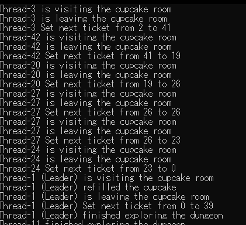
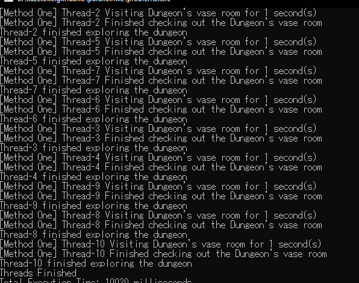

# parallelhw2

# Compiling and running

1-Go to the directory with problem1.cpp or problem2.cpp

2-Run the following command:

__g++ -std=c++11 problem1.cpp -o problem1 -lpthread__ <br>
(for problem 1)<br>
__g++ -std=c++11 problem2.cpp -o problem2 -lpthread__ <br>
(for problem 2)<br>

3-Run the following command:

__./problem1__ 
(for problem 1)<br>
__./problem2__ 
(for problem 2)<br>

4-Check console for results

# Theory

# Problem 1

The strategy for problem one consisted in designating one person as the leader or counter, this thread would then have the following job:<br>
1-When counter goes into the room, if the cupcake is missing he has to add one to his count because it means someone ate the cake<br>
2-Before leaving, he asks the minotaur servants for another cake<br>
3-If he comes across a cupcake, he ignores it and does not add +1 to the counting<br>

The other guests would have a simpler job, their job involved the following:<br>
1-If they have never eaten the cupcake and come across one, they will eat it and leave.<br>
2-If they have already eaten the cupcake and come across another one, they will ignore it and leave.<br>

With these two roles, we will know when everyone has gone through at least once when the counter has reached the same number as the amount of guests.<br>

Now, how is this done with threads?<br>
In problem1.cpp, we have a **guest** function, this is the function that the threads get created on, this function contains a flag to whetheer or not the guest is the counter/leader.<br>
Next, we have a **Dungeon** class, this class is in charge of having a **cupcake_room** function which handles the guests going in and doing their job.<br>
```cpp
        void cupcake_room(std::string thread_name, bool refill_cupcake, bool consume_cupcake, bool* refilled_cupcake, bool* ate_cupcake){
            bool refilled = false;
            threadsafe_debug(thread_name, "is visiting the cupcake room");
            if ( has_cupcake){
                threadsafe_debug(thread_name, "found the cupcake");
                if (consume_cupcake){
                    threadsafe_debug(thread_name, "and ate the cupcake");
                    has_cupcake = false;
                    *ate_cupcake = true;
                }
            }
            if (!has_cupcake && refill_cupcake){
                threadsafe_debug(thread_name, "refilled the cupcake");
                refilled = true;
                has_cupcake = true;
            }

            *refilled_cupcake =  refilled;
            threadsafe_debug(thread_name, "is leaving the cupcake room");
            set_next_ticket(thread_name);
        }

        void nothing_room(std::string thread_name){
            threadsafe_debug(thread_name, "says there's nothing here");
        }
```
<br>Only the leader has **refill_cupcake** as true, the rest only eat if **ate_cupcake** is set to false.<br>

As for how the threads are instructed to go in, since I wanted to keep it random I used a **ticket** system, which works in the following way:<br>
1-The ticket number goes from 1 to number_guests<br>
2-The ticket is set to a random number on runtime<br>
3-Each guest has a private id attribute<br>
4-The ticket number is randomized after each thread leaves the dungeon<br>
5-Only the thread with an ID matching the ticket number is allowed to go into the dungeon<br>
6-If they don't have the matching number, they will be in a while loop that puts them to sleep for a few miliseconds<br>

As such, the guests do nothing until it is their turn and only their turn to go in, this is random and done by an external force(in this case, the minotaur)<br>



<br>*Example output*<br>

# Problem 2

First, let's see the advantages and disadvantages of each:<br>

# Method 1<br>

It is the easiest to implement and very safe aswell random, since the threads will be trying to enter when they can.<br>
The disadvantages are that the threads may be waiting on each other when they could be doing other tasks, and they are prone to entering the dungeon again right away.<br>

# Method 2 <br>
The advantage is that the threads can do other tasks while the room is set to busy, they aren't just checking whether or not they can enter the dungeon every single time.<br>
The disadvantages are that it takes more implementation and the room checking might not happen right away.<br>

# Method 3<br>
The advantage is that the threads are guaranteed to run in the order in which they arrived, and it is not up to which thread has the luck of checking the mutex first. Also, no other thread can execute before <br>
their turn.<br>
The disadvantages are that there are more caveats in managing structures like queues with threads without the use of mutex/locks. As well as errors when scaling up due to queue operations<br>

# Method implemented<br>
I implemented both method 1 and 2, by default the program uses 1 since that is the safest one, even if it creates a mob of people around the door it will still guarantee that people go in as soon as they can. <br>
Having said that, I do believe that method #3 is the best one but every possible implementation of it that I tried ran into slowing issues because the queue required locks to function properly.<br>
The problem with method 1 and 2 is that you could have a thread repeatedly going before the other ones and therefore not giving other guests chances to look at the vase.<br>


<br>*Example output*